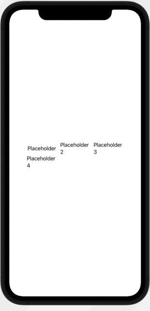
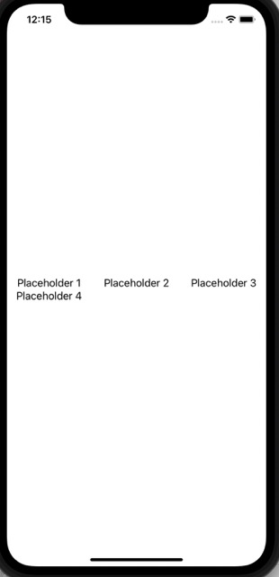
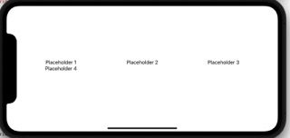
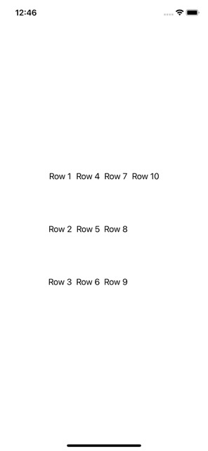

#  Grids in SwiftUI
From the CodeWithChris Design course: https://learn.codewithchris.com/courses/take/design/lessons/26070143-lesson-4-grids

# Fixed VGrid
The `VGrids` grow vertically, but place new content into each of the columns you defined.
The following code produces a LazyVGrid (shows only items the user views) with three columns of equal width (100),
5px spacing between each of them.
```
// MARK: - LazyVGrid
let columns = [
    // One single column; spacing determines spacing between columns
    GridItem(.fixed(100), spacing: 5, alignment: .center),
    GridItem(.fixed(100), spacing: 5, alignment: .center),
    GridItem(.fixed(100), spacing: 5, alignment: .center)
]

LazyVGrid(columns: columns) {
    Text("Placeholder")
    Text("Placeholder 2")
    Text("Placeholder 3")
    Text("Placeholder 4")
}
```


We can make this code more efficient by creating a `ForEach` loop through the elements:
```
LazyVGrid(columns: columns) {
    // Loop generates text
    ForEach(1..<5) { index in
        Text("Placeholder \(index)")
    }
}
```
In addition, instead of repeating the `GridItem` three times, we can use a special type of 
array to repeat that identical element three times:
```
let columns = Array(
    // One single column; spacing determines spacing between columns
    repeating: GridItem(.fixed(100), spacing: 5, alignment: .center), count: 3
)
```

# Flexible Columns
A flexible VGrid divvies up the space between each of the elements:
```
let flexibleColumns = Array(
       // One single column; spacing determines spacing between columns
       repeating: GridItem(
           .flexible(minimum: 0),
           spacing: 5,
           alignment: .center
       ),
       count: 3 // repeats three times
   )
```


Note that if we flip the iphone sideways (COMMAND + LEFT), it takes up even more space:


# Adaptive Columns
Under adaptive grid, you can specify the width, then if it has extra space, it creates more columns:
```
let adaptiveColumns = Array(
           repeating: GridItem(
            // Minimum width of 100
               .adaptive(minimum: 100),
               spacing: 5,
               alignment: .center
           ),
           count: 3 // repeats three times
       )
```


However, if the items go off the screen, then they will not be displayed. By default,
it does not allow you to scroll. Therefore, you need to add a ScrollView to accomplish this.
In addition, if you want to hide the scroll indicator on the side, you can do so by marking the
`showsIndicators` parameter as false:
```
ScrollView(showsIndicators: false) {
    LazyVGrid(columns: adaptiveColumns) {
        // Loop generates text
        ForEach(1..<200) { index in
            Text("Placeholder \(index)")
        }
    }
}
```
# LazyHGrid
As you add more items, it is placed in the next row below. Once it reached your max row length,
it will create a new column:
```
let fixedRows = Array(
            repeating: GridItem(
                .fixed(100),
                spacing: 5,
                alignment: .center
            ),
            count: 3 // repeats three times
        )
LazyHGrid(rows: fixedRows) {
        // Loop through 10 times
        ForEach(1..<11) { index in
            Text("Row \(index)")
        }
    }
```


However, if you add more items, then it goes off the screen. Therefore, you need to add a ScrollView
for these items. Although, you need to add a `horizontal` parameter to the `ScrollView` to allow it
to go horizontally:
```
ScrollView(.horizontal) {
    LazyHGrid(rows: fixedRows) {
            // Loop through 10 times
            ForEach(1..<50) { index in
                Text("Row \(index)")
            }
        }
}
```


